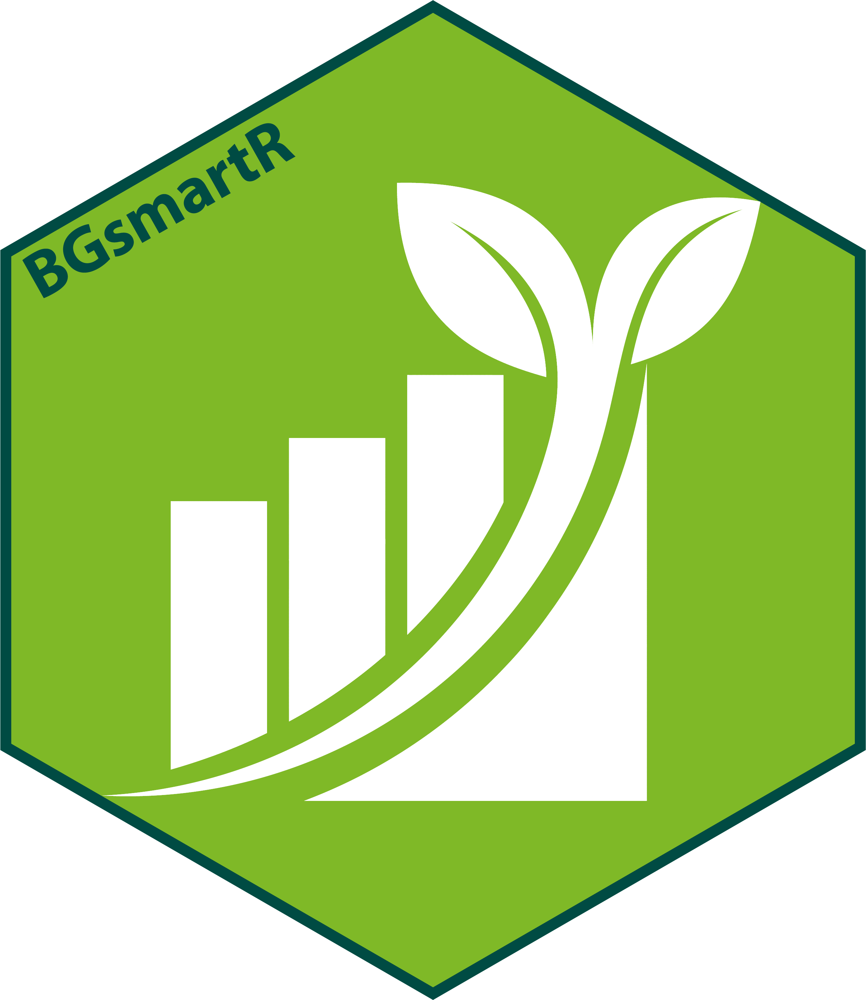

<!-- README.md is generated from README.Rmd. Please edit that file -->

```{r, include = FALSE}
knitr::opts_chunk$set(
  collapse = TRUE,
  comment = "#>",
  fig.path = "man/figures/README-",
  out.width = "100%"
)
```

# BGsmartR <a href="https://jakepowellcubg.github.io/BGR/"></a>


<!-- badges: start -->
<!-- badges: end -->

The goal of BGsmartR is to  enrich living collections records and create reports and analysis’ of collections.

## Installation

You can install the development version of BGsmartR from [GitHub](https://github.com/) with:

```{r}
# install.packages("devtools")
devtools::install_github("JakePowellCUBG/BGSmartR")
```

Note that the current version of BGsmartR relies on old versions `gtsummary` and `downloadthis` these can be installed via the method below.

```{r}
devtools::install_version(  
  "downloadthis",
  version = "0.3.0",
  repos = "http://cran.us.r-project.org"  
)


devtools::install_version(  
  "gtsummary",
  version = "1.7.2",
  repos = "http://cran.us.r-project.org"  
)

```
