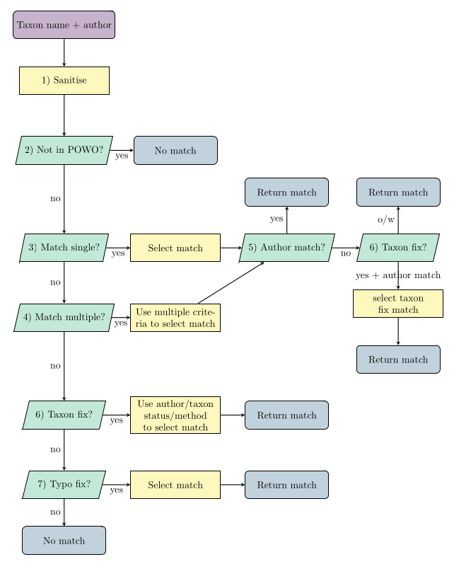

```{r, include = FALSE}
knitr::opts_chunk$set(
  collapse = TRUE,
  comment = "#>"
)
```

```{r setup}
library(BGSmartR)
```

```{r, echo = F}
load('data/wcvp_matching_example.rda')
```
# Introduction

In BGSmartR we use an opinionated method to match taxonomic records to enrichment databases (such as [Plants of the World Online](https://powo.science.kew.org) (POWO) or  [IUCN Red List](https://www.iucnredlist.org)) using taxonomic names of plants . Our method is automatic and does not require any manual alterations. Moreover, rather than rely on "fuzzy" matching in difficult cases we apply criteria functions to find the best possible match. 

Below we detail how our method works.

# Overview

Records in a collection are matched via their taxonomic name and taxonomic author/s (if provided). 
A frustration with taxonomic data is that often the taxonomic name itself is frequently not unique - for example [Abies taxifolia](https://powo.science.kew.org/results?q=Abies%20taxifolia). This is often compounded by collections not storing the taxonomic author, resulting in multiple matches. Moreover, since collections data are often converted from old paper records there is a strong chance that there could be mistakes or typos in the taxonomic name. For example an hybridization marker might be missed out or the wrong infraspecific group used.  

Hence, our method attempts to automatically fix these common issues. 


Matches of taxonomic records are found by processing the taxonomic name and taxonomic author/s through a matching 'pipeline'. The pipeline is summarized in the flow chart below.  



Each taxonomic record is matched by flowing through the pipeline shown. The purple state indicated the start of the algorithm. blue states correspond to obtaining a match (or no match), yellow to process steps and green to decisions that are made in the algorithm. 

To match your collections data to POWO/Red list/BGCI the algorithm has been wrapped into the function `enrich_report()`, using specific matching functions for each enrichment database. These can be used to match and enrich your collection without concerning yourself with the method applied. See vignette XX to see the function in action. 

For a custom-pipeline we have included all the functions used in `enrich_report()` which can be combined in any way desired.

Below we delve further into the details of each step of the algorithm.

***

# Algorithm

**(Below we will detail the algorithm for matching to POWO)**

Before any matching can occur we require a local version of WCVP information to be matched to. This can be created using  `import_wcvp_names()` function in BGSmartR. This takes the version of wcvp from POWO and "enhances" it to include extra information used in our matching algorithm.

This document outlines the method used to match taxonomic plant names to Plants of the World Online (POWO) using BGSmartR. This is an automatic process which only requires a list of plant names (and authors), which we shall refer to as the original report.

The matching algorithm can be split into the following steps (number corresponds to flowchart): 

- <1> Sanitise taxon names
- <2> Remove cultivars and indeterminantes 
- <3> Match taxon names to unique taxon names in POWO 
- <4> Match to non-unique taxon names in POWO 
- <5> Check for author mismatching
- <6> Try and fix the taxonomic names
-    A) Removing autonym
-    B) Adding hybridisation
-    C) Adding/changing infrageneric level
- <7> Try finding typos
- Update matches to accepted names
- Set remaining to not in POWO

The algorithm runs the steps in this EXACT order. 

After each step where matching occurs (2,3,4,6,7) the list of names to match is reduced by the names that we found. In other words, once a match is found for a single taxon name no more steps are taken. For example, if we found adding hybridisation leads to a match to POWO we will not search for typos. 

In practice the algorithm will be run in a single step using the function `match_original_to_wcvp()`.

We will now outline each step in the algorithm.

***

## 1) Sanitise taxon names

This step is used to standardise the format of the taxon name in the original report. The standard format we implement is every character should be lower case except for the first letter of the Genus. We standardise the hybrid sign to be `r '\u00D7'` rather than `x` or `X` (or the rare case of `h` or `H`). We also ensure that the infrageneric level is of the format `f.`, `var.`, `subsp.` or `nothosubsp.`.

Note that the sanitisation is also performed on POWO in the function `import_wcvp_names()`. 

This is performed on all taxon names that remain to be matched.

This is done using the function `sanitise_name()` which takes a single taxon name as an input. Below we outline some examples of using `sanitise_name()`.

```{r sanitise names}
sanitise_name('TRIGONELLA smyrnaea')
sanitise_name('Halimium X pauanum')
sanitise_name('Aruncus dioicus var acuminatus')
```

***

## 2) Remove cultivars and indeterminantes 

This step sets the match to `-1` for the taxon names we know do not appear in POWO. This includes cultivars and indeterminants. We find these taxon names by pattern matching in particular we check for the following patterns.

 - Includes ` sp.`.
 - Includes ` gx `.
 - Includes ` gx`.
 - Includes `'XX'` for some text XX. This is common notation for cultivars.
 - Includes `[`.
 - Begins with `Indet`. 
 - Ends in `indet`.
 - Ends in `cv`.
 - Includes `cv.`.
 - Includes `Group`.
 - Includes `unkn`.
 - Ends in `hybrid`.
 - Includes `unknown`.

This is performed using the function `no_match_cultivar_indet()`, which sets the match to `-1` for any taxonomic name found to be either an indeterminate or cultivar. For these taxon names we set the output message to `(Cultivar or Indeterminate <Do not attempt matching>)`. 

Below we provide an example of `no_match_cultivar_indet()`.

```{r no_match_cultivar_indet}
 taxon_names = c('Acalypha fruticulosa', 'Asclepias sp.', "Abies umbilicata 'Some Cultivar'", 
                 'Ammi copticum cv.')
 no_match_cultivar_indet(taxon_names)
```

 
***


## 3) Match taxon names to unique taxon names in POWO

This step matches the taxon names in the original report to the records in POWO that have a unique taxon name. By this we mean the taxon name exists for a single plant in POWO and there are not multiple plants with different authors sharing the same taxonomic name. 

As the name is unique no further matching criteria is required (e.g authors). 

This step is performed using the function `match_single()`. 

Below we outline an example of this function in action:

```{r match single}
# Choose some taxon names
taxon_names = c("Amaranthus graecizans subsp. silvestris", "Amsonia ciliata", "Aristolochia islandica", "Adenocalymma scabriusculum", "Fake name")

# Choose the indices of wcvp which correspond to a unique taxon name using `single_entry`.
wcvp_search_index_single = which(wcvp$wcvp_names$single_entry == T)

# Perform the match
match = match_single(taxon_names = taxon_names, enrich_database = wcvp$wcvp_names, enrich_database_search_index = wcvp_search_index_single)
match
```

We see that `match` is a list that contains:

- `$match` the corresponding row in `wcvp$wcvp_names`, if no match return `NA`. 
- `$message` that informs on how the match is obtained, if no match the message is set to `''`.

If we find a match the algorithm by default also provides the `powo_id` (e.g. `108437-3`) which can be used to search for the plant directly on POWO's website. This output code in the message can be changed for any column in `wcvp$wcvp_names` using the input `enrich_display_in_message_column`.

```{r match single 2}
match_single(taxon_names = taxon_names, enrich_database = wcvp$wcvp_names,
             enrich_database_search_index = wcvp_search_index_single,
             enrich_display_in_message_column = 'plant_name_id')

```

Moreover, for this function the match can be changed from the row number in `wcvp$wcvp_names` to any column using the input `match_column`, for example 

```{r match single 3}
match_single(taxon_names = taxon_names, enrich_database = wcvp$wcvp_names,
             enrich_database_search_index = wcvp_search_index_single,
             match_column = 'taxon_status')

```

***

## 4) Match to non-unique taxon names in POWO

This step searches for matches to POWO when the taxon name has multiple entries in POWO.

For example suppose our database contains the taxon name `'Abies taxifolia'`. Searching in POWO we find 6 records for that taxon name. 

```{r, echo = F}
 DT::datatable(wcvp$wcvp_names[wcvp$wcvp_names$taxon_name == 'Abies taxifolia', c(1:3,5,6)])
```

In WCVP each taxon name has an author, a taxon status and an accepted plant name. These quantities can be used to decide which record we should match to. 

### Matching Criteria.

The matching criteria is split into two parts: author matching and other matching. Author matching has higher priority and is performed using the function `match_authors()`. This will initially try to match the author exactly. If there are no exact matches it will then look for partial matches where both the authors for an item in the collection and WCVP share words.

Example of exact matching.
```{r match_authors}
# Restrict wcvp to only taxon_name = 'Abies taxifolia'
wcvp_Abies_taxifolia = wcvp$wcvp_names[wcvp$wcvp_names$taxon_name == 'Abies taxifolia',]

collection_author = 'Desf.'
wcvp_authors = wcvp_Abies_taxifolia$taxon_authors

# Match via authors
matched_info = match_authors(collection_author,wcvp_authors)
matched_info

# Restrict wcvp_Abies_taxifolia to only matched authors
 DT::datatable(wcvp_Abies_taxifolia[matched_info$wanted,c(1:3,5,6)])
```

Example of partial matching.

```{r match_authors 2}
collection_author = 'Jeffrey'

# Match via authors
matched_info = match_authors(collection_author,wcvp_authors)
matched_info

# Restrict wcvp_Abies_taxifolia to only matched authors
DT::datatable(wcvp_Abies_taxifolia[matched_info$wanted,c(1:3,5,6)])
```

By default partial matching chooses the records that shares the most words with the author given in the collection (by default the input `partial_method = 'most words'`) this can be changed to chose any record with any level of partial matching using `partial_method = 'any words'`.

***

Other matching is performed by the so called `matching_criteria()` function, this takes an extract of the enrichment database (often those with idenitical taxon names) and attempts to choose the best record using some criteria and returns the rows which correspond to the best match. 

To allow flexibility this function is passed as the input  `matching_criteria` to `get_match_from_multiple()`, the function that applies both author matching and other matching. The package contains two matching criteria functions `no_additional_matching()` and `additional_wcvp_matching()`. 

`additional_wcvp_matching()` matches records by first looking at `accepted_plant_name_id` of the wcvp records passed to it, if all the accepted plants names are the same the function returns an accepted taxon status row or if non of these exists just the first row. If there are differences in `accepted_plant_name_id` then the function looks at `taxon_status` and returns any rows that are accepted, and if non are accepted any that are synonyms. 

A couple examples are given below.

```{r other matching}
# Apply to first 3 rows of taxon name  = Abies_taxifolia (i.e all have the same accepted plant name id)
additional_wcvp_matching(wcvp_Abies_taxifolia[1:3,])

# Apply to rows 1,4,6 of taxon name  = Abies_taxifolia (i.e differing accepted plant name ids only only has taxon status = synonym)
additional_wcvp_matching(wcvp_Abies_taxifolia[c(1,4,6),])

```

### matching function. 

The author matching and other matching is combined into the function `get_match_from_multiple()` for a single taxonomic name and author.

```{r get_match_from_multiple}
get_match_from_multiple(taxon_name_and_author = c('Abies taxifolia', 'Desf.'),
                        enrich_database_mult = wcvp$wcvp_names[!wcvp$wcvp_names$single_entry,], #wcvp restricted to only non-unique taxon names.
                        matching_criterion = BGSmartR::additional_wcvp_matching,
                        enrich_taxon_authors_column = 'taxon_authors') # the column in wcvp referring to taxon_authors
```

Then to do matching for multiple records in one go we use the function `match_multiple()`. 

```{r}
taxon_names = c('Abies taxifolia', 'Abies taxifolia', 'Other Name')
taxon_authors = c('Desf.', 'Jeffrey', 'Craig')
enrich_database = wcvp$wcvp_names
enrich_database_search_index = which(!wcvp$wcvp_names$single_entry)
match_multiple(taxon_names,
               taxon_authors,
               enrich_database,
               enrich_database_search_index,
               show_progress = FALSE,
               enrich_taxon_authors_column = 'taxon_authors')
```
***

## 5) Check original author names compared to matched authors

This step is used to compare the author names in the original report and the matched record in POWO. The authors are judged to be in one of 3 categories:

- `Exact` match, the authors are identical.
- `Partial` match, the authors are split into words and at least one word is contained in the other (i.e a word in original author is in matched author, or vice versa).
- `Different`, the authors are not in the above categories. 

To extract words from an author name we use the function `author_words()`. This extracts all words which start with a capital letter and has at least length 3 (including hyphens), together with `DC.`, `Sm.` and `Br.`. Below we provide an example

```{r}
# author_words('Nakai & Tuyama')
# author_words('J.C.Wendl. ex Hornem.')
```

The comparison of authors is performed by the function `author_check()` which given the original author and the matched author returns one of the three messages outlined above. For example

```{r}
# author_check('Oliv.','Oliv.')
# author_check('(Bong.) D.Don (Piper) C.L.Hitche','(Piper) C.H.Hitchc.')
# author_check('L.','(W.D.J.Koch) Arcang.')
```

The matching also returns the 'match' names and authors prior to converting to accepted names.

***


## 6) Try and fix the taxon

This step tries 3 methods to try and fix the taxon to get a match

### A) Try removing autonym

This step tries to match taxon names after the autonym has been removed. 

For example suppose we have `'Acmena hemilampra subsp. hemilampra'` in our original report. This does not exist in POWO. If we remove the autonym then we might be able to match a record in POWO. Therefore we want to try 1 'potential' taxon name:

```{r, echo = F}
# 'Acmena hemilampra'
```


The 'potential' taxon name is matched to POWO using steps (5) and (6), to match to unique and non-unique taxon names respectively. If a single match is found we return this.

This is all contained in the function `match_rm_autonym()`, which takes as an input the taxon names, taxon names with the author and POWO information and returns the matches. This is shown below in an example.

```{r match_rm_autonym, message=FALSE}
# # Choose some taxon names
# taxon_names = c('Acmena hemilampra subsp. hemilampra', 'Aesculus rubicunda',
#                 'Acacia fake var. fake')
# 
# # Perform the match
# match = match_rm_autonym(taxon_names = taxon_names, taxon_authors = taxon_names, enrich_database = wcvp$wcvp_names)
# match
```

We see that if we find a match to the potential taxon name we return the index of the match, and a message informing that we removed the autonym. Potential names that do not find a match and taxon names that are not autonyms have match equal to `NA` and no message.


***

### B) Try adding hybridisation

```{r adding_hybrid_example, echo = F}
#   hybrids = c('\u00D7', '+')
# 
# ## Case 1.
# # The taxon name we cannot find a match for.
# taxon_name = 'Asplenosorus'
# to_try_words_1 = unlist(lapply(taxon_name, function(x){
#       return(c(paste('+',x,collapse =' '), paste('\u00D7', x, collapse = ' ')))
#     }))
# 
# ## Case 2.
# # The taxon name we cannot find a match for.
# taxon_name = 'Aesculus rubicunda var. whitleyi'
# words_2_3_4 = stringr::str_split(taxon_name, ' ', n=2)
#  to_try_words_2 = unlist(lapply(words_2_3_4, function(x){
#       before_first_word = paste(hybrids, x[1],x[2])
#       after_first_word = paste(x[1], hybrids, x[2])
#       return(c(before_first_word,after_first_word))
#     }))
# 
# taxon_name = 'Artemisia + pfaffii'
#  to_try_words_3 = unlist(lapply(taxon_name, function(x){
#       A=stringr::str_replace(x,pattern = '\u00D7|\\+', '')
#       B=stringr::str_replace(x,pattern = '\u00D7|\\+', '\\+')
#       C=stringr::str_replace(x,pattern = '\u00D7|\\+', '\u00D7')
#       options = c(A,B,C)
#       options = stringr::str_squish(options)
#       options = options[-match(x, options)]
#       return(options)
#     }))
```

This step checks whether adding or removing hybrid markers yields a match. In particular, this step will consider three cases: 

<hr style="border: 0.3px solid green; width:80%;"></hr>

##### 1) Single words 

For example suppose we have `'Asplenosorus'` in our original report. This does not exist in POWO. Maybe we have a missing hybrid at the start, which could be either `×` or `+`. Therefore we want to try 2 'potential' taxon names:

```{r, echo = F}
# to_try_words_1
```

##### 2) Taxon names with no hybrid and contains 2/3/4 words. 

For example suppose we have `'Aesculus rubicunda var. whitleyi'` in our original report. This does not exist in POWO. Maybe we have a missing hybrid at the start or after the first word. The hybrid symbol could be either `×` or `+`. Therefore we want to try 4 'potential' taxon names:

```{r, echo = F}
# to_try_words_2
```

##### 3) Taxon names that contain exactly one `×` or `+`.

For example suppose we have `'Artemisia + pfaffii'` in our original report. This does not exist in POWO. Maybe the hybrid symbol is wrong (should be `×`) or perhaps there should not be a hybrid symbol at all. Therefore we want to try 2 'potential' taxon names:

```{r, echo = F}
# to_try_words_3
```

<hr style="border: 0.3px solid green; width:80%;"></hr>

For each of the three cases we then match the 'potential' taxon names to POWO using steps (5) and (6), to match to unique and non-unique taxon names respectively. If a single match is found we return this. If multiple potential matches are found we change the output message informing the user that multiple matches are found and for which names this is the case, and no match is found.

This is all contained in the function `match_hybrid_issue()`, which takes as an input the taxon names, taxon names with the author and POWO information and returns the matches. This is shown below in an example.

```{r match_hybrid_issue, message=FALSE}
# # Choose some taxon names
# taxon_names = c('Asplenosorus', 'Aesculus rubicunda var. whitleyi',
#                 'Artemisia + pfaffii', 'Acacia fake name')
# 
# # Perform the match
# match = match_hybrid_issue(taxon_names = taxon_names, taxon_authors = taxon_names, enrich_database = wcvp$wcvp_names)
# match
```

We see that if we find a single match in the potential taxon names then the index of the match is returned. If multiple potential names find matches then the match index is set to `-5` and the message informs of the potential taxon names that lead to matches (this is not shown in the example above as no cases exist when the first letter is A, for an example see Try adding/changing infrageneric level). If we find no matches for any of the potential names the index is set to `NA` and the message is left blank.

***

### C) Try adding/changing infrageneric level

This step checks whether adding or updating infrageneric level information yields a match. In particular, this step will consider three cases: 

<hr style="border: 0.3px solid green; width:80%;"></hr>

##### 1) Adding infrageneric level (and hybrid) to taxon names with three words. 

```{r 3 word example, echo = F}
# infra = c('subsp.', 'var.', 'f.', 'nothosubsp.')
# splitters_grepl = ' subsp\\. | var\\. | f\\. | nothosubsp\\. '
# 
# ## Case 1.
# # The taxon name we cannot find a match for.
# taxon_name = 'Amorphophallus calabaricus mayoi'
# 
# # Split the taxon name into words.
# words_3 = stringr::str_split(taxon_name, ' ')
# 
# 
# # Find the taxon names we want to try and find a match for.
# to_try_words_1 = unlist(lapply(words_3, function(x){
#   just_infra = paste(x[1], x[2], infra, x[3])
#   hybrid_and_infra =  paste(x[1], '\u00D7', x[2], infra, x[3])
#   return(c(just_infra,hybrid_and_infra))
# }))
# 
# ## Case 2.
# # The taxon name we cannot find a match for.
# taxon_name = 'Asplenium × corbariense andorranum'
# 
# # Split the taxon name into words.
# words_4 = stringr::str_split(taxon_name, ' ')
# 
# 
# # Find the taxon names we want to try and find a match for.
# to_try_words_2 = unlist(lapply(words_4, function(x){
#   just_splitter = paste(x[1], x[2], x[3], infra, x[4])
#   return(just_splitter)
# }))
# 
# taxon_name = 'Atriplex glabriuscula f. franktonii'
#  to_try_words_3 = unlist(lapply(taxon_name, function(x){
#       A=stringr::str_replace(x,pattern = splitters_grepl, ' var\\. ')
#       B=stringr::str_replace(x,pattern = splitters_grepl, ' f\\. ')
#       C=stringr::str_replace(x,pattern = splitters_grepl, ' subsp\\. ')
#       D=stringr::str_replace(x,pattern = splitters_grepl, ' nothosubsp\\. ')
#       options = c(A,B,C,D)
#       options = options[-match(x, options)]
#       return(options)
#     }))
```

For example suppose we have `'Amorphophallus calabaricus mayoi'` in our original report. We see that as we have three words we have potentially missed adding the infrageneric level to the taxon name. This could be either: `subsp.`, `var.`, `f.` or `nothosubsp.`. Moreover, since we missed the infrageneric level we might have also missed hybridisation. so we also want to check if we need to add `×` to the taxon name. Therefore, we want to try 8 'potential' taxon names: 

```{r, echo = F}
# to_try_words_1
```

##### 2) Adding infrageneric level to taxon names with four words that contain hybrid.

For example suppose we have `'Potamogeton × spathulatus svecicusi'` in our original report. We see that as we have four words including a hybrid. Thus we might have potentially missed adding the infrageneric level after the third word in the taxon name. This could be either: `subsp.`, `var.`, `f.` or `nothosubsp.`. Therefore, we want to try 4 'potential' taxon names: 

```{r, echo = F}
# to_try_words_2
```

##### 3) Changing the infrageneric level. 

For example suppose we have `'Ajuga chamaepitys f. media'` in our original report. This taxonomic names does not match any record in POWO. Thus the infrageneric level could be wrong. This could be either: `subsp.`, `var.` or `nothosubsp.`. Therefore, we want to try 3 'potential' taxon names: 

```{r, echo = F}
# to_try_words_3
```

<hr style="border: 0.3px solid green; width:80%;"></hr>

For each of the three cases we then match the 'potential' taxon names to POWO using steps (5) and (6), to match to unique and non-unique taxon names respectively. If a single match is found we return this. If multiple potential matches are found we change the output message informing the user that multiple matches are found and for which names this is the case, and no match is found.

This is all contained in the function `add_splitter()`, which takes as an input the taxon names, taxon names with the author and POWO information and returns the matches. This is shown below in an example.

```{r add splitter, message=FALSE}
# # Choose some taxon names
# taxon_names = c('Atractylis carduus glabrescens', 'Asplenium × corbariense andorranum',
#                 'Atriplex glabriuscula f. franktonii', 'Acacia tortilis raddiana', 'Acacia fake name')
# 
# # Perform the match
# match = match_splitter_issue(taxon_names = taxon_names, taxon_authors = taxon_names, enrich_database = wcvp$wcvp_names)
# match
```

We see that if we find a single match in the potential taxon names then the index of the match is returned. If multiple potential names find matches then the match index is set to `-5` and the message informs of the potential taxon names that lead to matches. If we find no matches for any of the potential names the index is set to `NA` and the message is left blank.

***

## 7) Try find typo

This stage searches for typos in the taxon name. Typos are found in three ways:

<hr style="border: 0.3px solid green; width:80%;"></hr>


##### Searching a data frame of original names and fixed names.

In our package we include a data frame of typos that can be found by `BGSmartR::typo_list`. This contains 9,782 typos that we have found in garden databases.

We first find typos by checking against `BGSmartR::typo_list`.

```{r}
# head(BGSmartR::typo_list)
```

##### Searching for common issues found in taxon names.

If we have not found a match in the typo list we then check for common issues found in taxon names. This includes changing the end of the taxon name. In particular we check for the following endings and their replacements. 

- 'i' <-> 'ii'
- 'i' <-> 'ae'
- 'a' <-> 'um'
- 'a' <-> 'us'
- 'ae' <-> 'eae'
- 'e' <-> 'is'
- 'is' <->'e'
- 'us' <-> 'is'
- 'ense' <->'iense'
- 'oides' <-> 'ioides'
- 'orum' <-> 'iorum'

We also check the following patterns anywhere in the taxon name:

- 'i' <-> 'ae'

##### Searching for a single change in letter.

Our final stage performs a larger check for a change in single character. This involves:

- Checking removing a single character from the taxon name in all positions.
- Checking adding a single character (a-z and '-') in all positions.
- Changing a current letter to any character in a-z in all positions.

<hr style="border: 0.3px solid green; width:80%;"></hr>

To check whether a typo exists we can use the function `check_taxon_typo()`, which checks all potential fixes against the names in POWO. 

To check for typos and match to records in POWO we use the function `match_typo()`. An example is outlined below.

```{r match_typo, message=FALSE}
# # Choose some taxon names
# taxon_names = c('Acalypha stellipilus', 'Aiphanes lucana',
#                 'Acer × pseudocreticums', 'Amaranthus paraguay-ensis', 'Acacia fake name')
# 
# # Perform the match
# match = match_typos(taxon_names = taxon_names, taxon_authors = taxon_names, enrich_database = wcvp$wcvp_names, typo_method = 'full')
# match
```


***

## 12) Update matches to accepted names

To update taxon names to their accepted form we use the field `accepted_plant_name_id` in POWO. If the `accepted_plant_name_id` does not match `plant_name_id` then we update the match to correspond to the accepted plant. This is performed by the function `convert_to_accepted_name()` in BGSmartR, which takes in the current state of the matches and updates to the accepted form. An example is given below.

```{r}
# taxon_names = c('Adina nobilis', 'Acalypha gracilens var. fraseri', 
#                 'Andira zehntneri')
# match = match_single(taxon_names,wcvp$wcvp_names,wcvp_search_index_single)
# match
# new_match = convert_to_accepted_name(match$match, wcvp)
# new_match
# 
# #Putting the messages together.
# messages = paste0(match$message, new_match$message)
# messages
```

We see that the first two taxon names go to an accepted form and the third does not. This is shown by both `$match` remaining the same and an empty `$message` after running `convert_to_accepted_name()`.

We can check the accepted name by using the codes provided in the message on POWO's website. This is done by changing the last part of the URL. For example `Adina nobilis` can be found at the address https://powo.science.kew.org/taxon/urn:lsid:ipni.org:names:742921-1. We see that this is indeed a synonym of Adina racemosa.

***

## 13) Set remaining to not in POWO

We set the match index to `-3` for the remaining taxon names. In the messages we add `(Not in POWO)`.  

***
